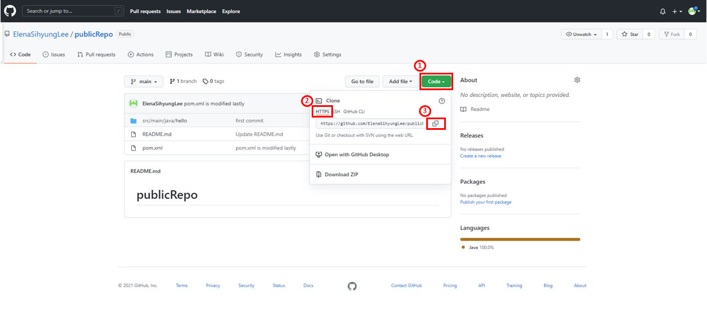
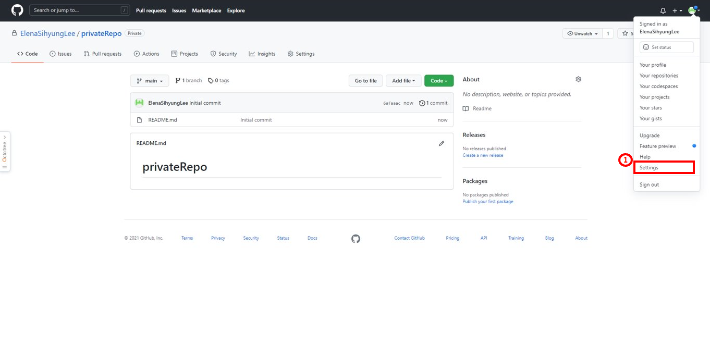
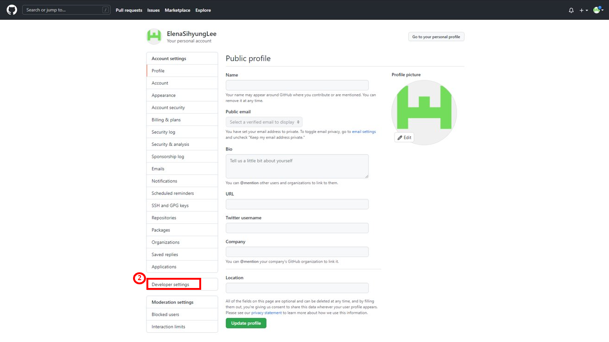
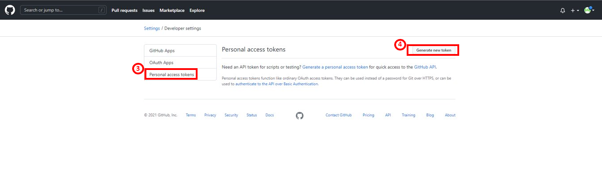
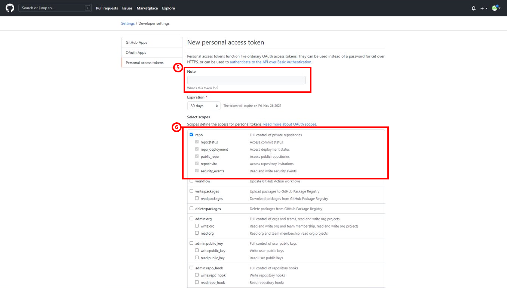
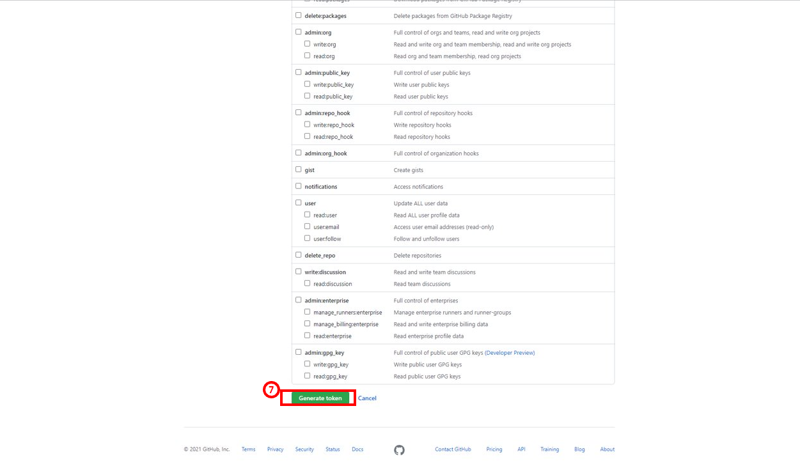
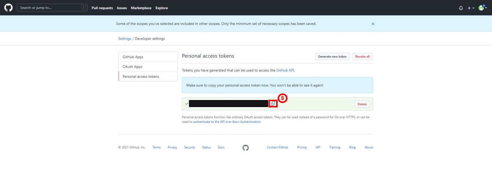

# java-source2build 사용 가이드

## 구성 요소 및 버전
* java 8 (jdk-8u211)
* maven ([apache-maven-3.8.3](https://dlcdn.apache.org/maven/maven-3/3.8.3/binaries/apache-maven-3.8.3-bin.tar.gz))
* gradle ([gradle-7.2](https://services.gradle.org/distributions/gradle-7.2-bin.zip))

## Prerequisites

### git repository

java-source2build 사용하기 전 아래의 과정을 통해 사용자의 git repository 정보를 준비한다.

Case 1. 사용자의 git repository 가 public 인 경우
    
    * 예시
    
  
Case 2. 사용자의 git repository 가 private 인 경우 (Token 필요)
    
    * 예시
    

    

    

    

    

    

## Install Steps
0. [efk yaml 수정](https://github.com/tmax-cloud/hypercloud-install-guide/tree/master/EFK#step-0-efk-yaml-%EC%88%98%EC%A0%95)
1. [ElasticSearch 설치](https://github.com/tmax-cloud/hypercloud-install-guide/tree/master/EFK#step-2-elasticsearch-%EC%84%A4%EC%B9%98)
2. [kibana 설치](https://github.com/tmax-cloud/hypercloud-install-guide/tree/master/EFK#step-3-kibana-%EC%84%A4%EC%B9%98)
3. [fluentd 설치](https://github.com/tmax-cloud/hypercloud-install-guide/tree/master/EFK#step-4-fluentd-%EC%84%A4%EC%B9%98)

## Step 0. efk yaml 수정
* 목적 : `efk yaml에 이미지 registry, 버전 및 노드 정보를 수정`
* 생성 순서 : 
    * 아래의 command를 사용하여 사용하고자 하는 image 버전을 입력한다.
	```bash
	$ sed -i 's/{busybox_version}/'${BUSYBOX_VERSION}'/g' 01_elasticsearch.yaml
	$ sed -i 's/{es_version}/'${ES_VERSION}'/g' 01_elasticsearch.yaml
	$ sed -i 's/{kibana_version}/'${KIBANA_VERSION}'/g' 02_kibana.yaml
	$ sed -i 's/{fluentd_version}/'${FLUENTD_VERSION}'/g' 03_fluentd.yaml
	
	```
* 비고 :
    * `폐쇄망에서 설치를 진행하여 별도의 image registry를 사용하는 경우 registry 정보를 추가로 설정해준다.`
	```bash
	$ sed -i 's/docker.elastic.co\/elasticsearch\/elasticsearch/'${REGISTRY}'\/elasticsearch\/elasticsearch/g' 01_elasticsearch.yaml
	$ sed -i 's/docker.elastic.co\/kibana\/kibana/'${REGISTRY}'\/kibana\/kibana/g' 02_kibana.yaml
	$ sed -i 's/fluent\/fluentd-kubernetes-daemonset/'${REGISTRY}'\/fluentd-kubernetes-daemonset/g' 03_fluentd.yaml
	```    
    
## Step 1. ElasticSearch 설치
* 목적 : `ElasticSearch 설치`
* 생성 순서 : 
    * EFK를 설치할 Namespace를 생성한다.
	```bash
	$ kubectl create ns kube-logging
	```     
    * [01_elasticsearch.yaml](yaml/01_elasticsearch.yaml) 실행 `ex) kubectl apply -f 01_elasticsearch.yaml`
## Step 2. kibana 설치
* 목적 : `EFK의 UI 모듈인 kibana를 설치`
* 생성 순서 : [02_kibana.yaml](yaml/02_kibana.yaml) 실행 `ex) kubectl apply -f 02_kibana.yaml`
* 비고 :
    * kibana pod가 running임을 확인한 뒤 http://$KIBANA_URL에 접속해 정상 동작을 확인한다.
    * $KIBANA_URL은 `kubectl get svc -n kube-logging | grep kibana`를 통해 조회 가능
   

## Step 3. fluentd 설치
* 목적 : `EFK의 agent daemon 역할을 수행하는 fluentd를 설치`
* 생성 순서 : [03_fluentd.yaml](yaml/03_fluentd.yaml) 실행 `ex) kubectl apply -f 03_fluentd.yaml`
* 비고 :
    * 만약 해당 Kube 환경의 Container Runtime이 Docker가 아니라 CRI-O일 경우, [03_fluentd_cri-o.yaml](yaml/03_fluentd_cri-o.yaml) 실행 `ex) kubectl apply -f 03_fluentd_cri-o.yaml`
